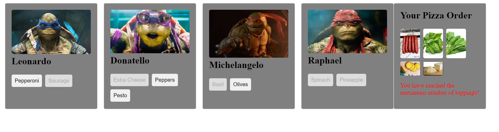
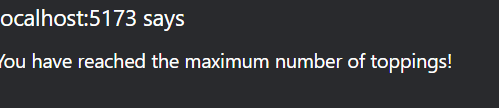

# React: Styling - Teenage Mutant Ninja Turtles Pizza Ordering App
## Description
This application is a pizza ordering app for the Teenage Mutant Ninja Turtles. Each turtle has a different set of pizza toppings they like to eat, and the user can add up to five toppings to their order.

## Technologies Used
- React
- useState
- styled-components
- rendering list

## Installation
1. Clone the repository ```bash 
git clone https://github.com/HasanTayar/React-Styling
```
2. Run `npm install` to install dependencies
3. Run `npm start` to start the development server
4. run `npm i styled-components ` to dowbload the styled commponents

## Usage
1. Open the application in the browser
2. View the list of turtles and their favorite pizza toppings
3. Click on a topping to add it to the order
4. If five toppings have already been selected, a message will be displayed informing the user they have reached the maximum
5. If a topping has already been selected, a message will be displayed informing the user it has already been added to the order
## Demo
[Click me!](https://youtu.be/jNHhu3ciozo)

## Data
The data for the application is stored in `src/data.js`.
## Components

### `Turtle`

Displays a card for a single turtle with an image and a list of pizza toppings.

## ScreenShots
### Limited topic Reached

### Alert



